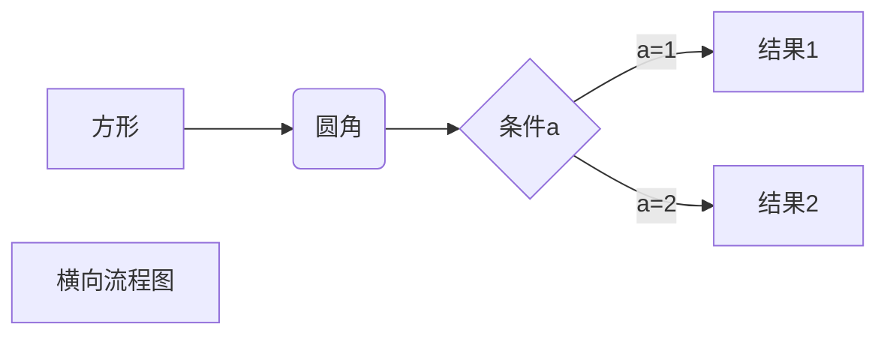
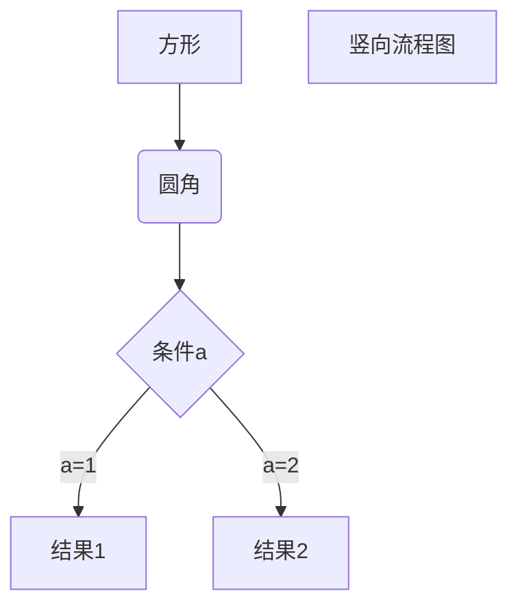
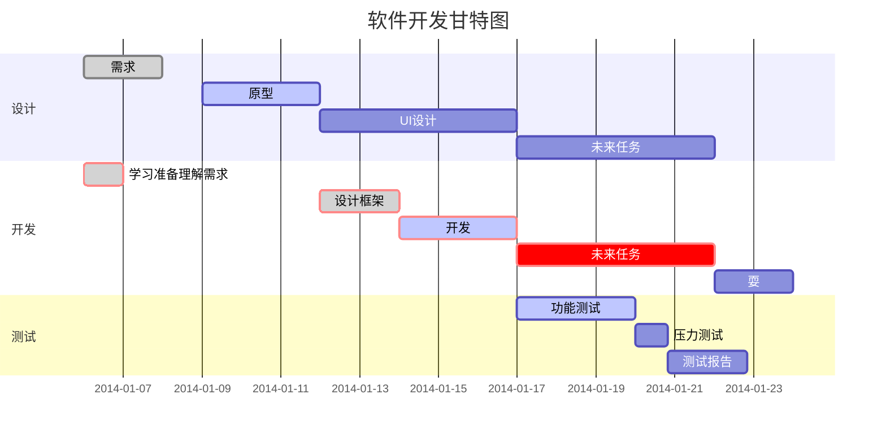

* 第一项
* 第二项
* 第三项

+ 第一项
+ 第二项
+ 第三项


- 第一项
- 第二项
- 第三项

1. 第一项
2. 第二项
3. 第三项

1. 第一项：
    - 第一项嵌套的第一个元素
    - 第一项嵌套的第二个元素
2. 第二项：
    - 第二项嵌套的第一个元素
    - 第二项嵌套的第二个元素

> 区块引用
> 菜鸟教程
> 学的不仅是技术更是梦想 
-------
> 最外层
> > 第一层嵌套
> > > 第二层嵌套

- - -
* 第一项
    > 菜鸟教程
    > 学的不仅是技术更是梦想
* 第二项


`printf()` 函数

    include <stdiio.h>
    int main(){
        printf("Hello World");
        return 0;
    }
    

```javascript
$(document).ready(function () {
    alert('RUNOOB');
});
```    


这是一个链接 [百度](https://www.baidu.com)

<https://www.baidu.com>


这个链接用 1 作为网址变量 [Google][1]
这个链接用 runoob 作为网址变量 [Runoob][runoob]
然后在文档的结尾为变量赋值（网址）

  [1]: http://www.google.com/
  [runoob]: http://www.runoob.com/


这个链接用 1 作为网址变量 [RUNOOB][1].
然后在文档的结尾为变量赋值（网址）

[1]: https://static.jyshare.com/images/runoob-logo.png


|  表头1   | 表头2  |
|  ----  | ----  |
| 单元格1  | 单元格2 |
| 单元格3  | 单元格4 |


| 左对齐 | 右对齐 | 居中对齐 |
| :-----| ----: | :----: |
| 单元格1 | 单元格2 | 单元格3 |
| 单元格4 | 单元格5 | 单元格6 |


使用 <kbd>Ctrl</kbd>+<kbd>Alt</kbd>+<kbd>Del</kbd> 重启电脑

**文本加粗** 
\*\* 正常显示星号 \*\*


------
$$
\begin{Bmatrix}
   a & b \\
   c & d
\end{Bmatrix}
$$
$$
\begin{CD}
   A @>a>> B \\
@VbVV @AAcA \\
   C @= D
\end{CD}
$$


------


-----

-----

